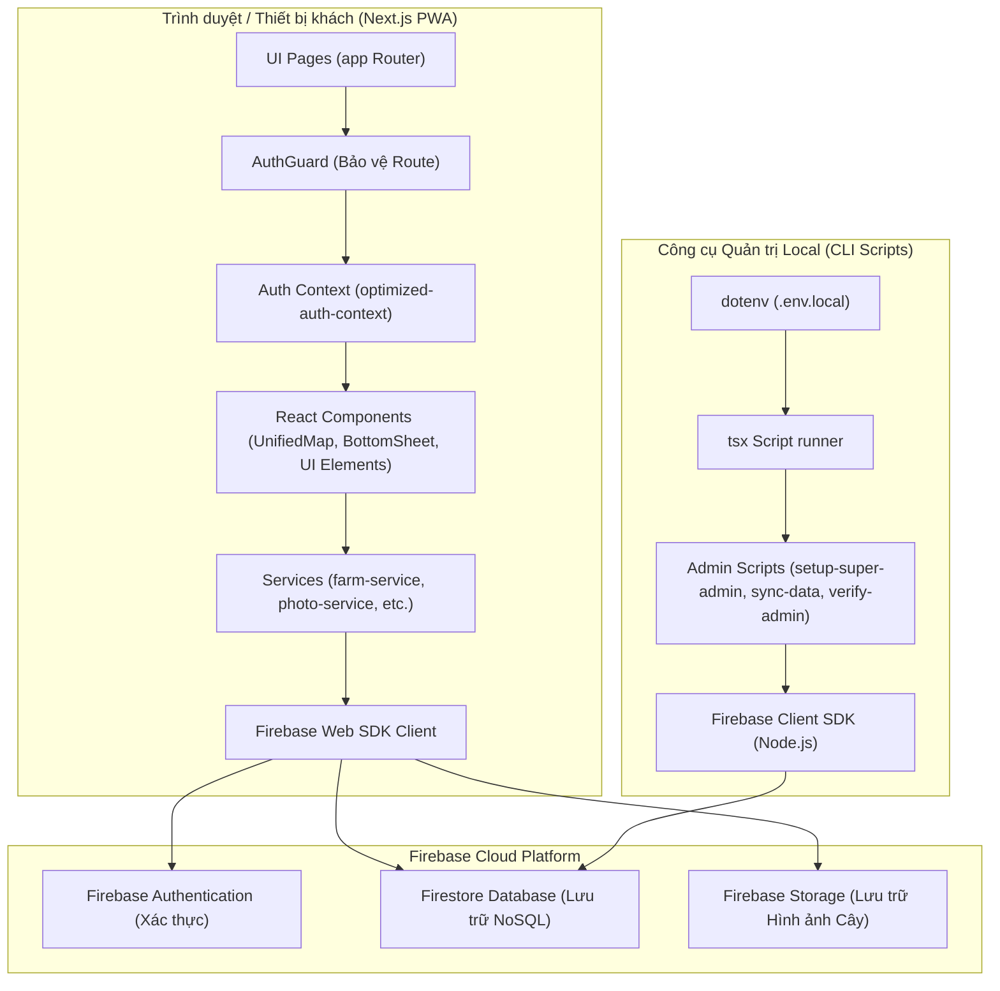
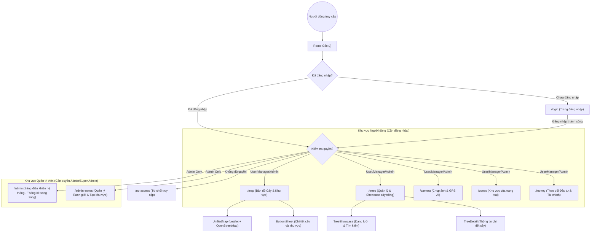

# Farm Manager - Ứng dụng Quản lý Trang trại Sầu Riêng

## Tổng quan

Farm Manager là một ứng dụng di động web (PWA) được thiết kế để quản lý trang trại sầu riêng thông minh. Ứng dụng hỗ trợ chụp ảnh cây trồng bằng AI, theo dõi vị trí GPS thời gian thực, và quản lý dữ liệu nông trại một cách hiệu quả.

## Bản đồ Chi tiết Ứng dụng (Architecture & Application Maps)

Dưới đây là các bản đồ trực quan mô tả cấu trúc hệ thống, luồng dữ liệu điều hướng và cấu trúc cơ sở dữ liệu của ứng dụng.

### 1. Sơ đồ Kiến trúc Hệ thống (System Architecture)
Sơ đồ này mô tả cấu trúc phân lớp của ứng dụng, sự tương tác giữa client-side (Next.js), database (Firebase), và các script CLI quản trị ở môi trường local.



### 2. Bản đồ Điều hướng & Phân quyền Trang (Navigation & Page Routing Map)
Ứng dụng sử dụng cấu trúc Next.js App Router với `AuthGuard` để bảo vệ các tuyến đường yêu cầu xác thực hoặc phân quyền quản trị viên.



### 3. Sơ đồ Thực thể Cơ sở dữ liệu (Database Schema ERD)
Mô tả cấu trúc dữ liệu NoSQL Firestore, các subcollections, và mối quan hệ logic giữa các collection.

```mermaid
erDiagram
    users {
        string uid PK "Mã định danh User"
        string email
        string displayName
        string accountStatus "active | suspended"
        boolean isEmailVerified
        timestamp createdAt
        object preferences "Giao diện, ngôn ngữ, thông báo"
    }
    userRoles {
        string id PK "Mã ID Vai trò"
        string userId FK "userId liên kết với users"
        string roleType "super_admin | admin | manager | viewer"
        string scopeType "system | farm"
        string farmId FK "Liên kết với farms nếu scopeType = farm"
        array permissions "Danh sách quyền hạn cụ thể"
        boolean isActive
    }
    adminConfig {
        string id PK "Mã cấu hình (chỉ có 1 bản ghi: 'main')"
        array superAdminUsers "Mảng các UID có quyền Super Admin tối cao"
        boolean enhancedRoleSystem "Bật hệ thống phân quyền nâng cao"
        string systemVersion "Phiên bản hệ thống"
        timestamp lastUpdated
    }
    farms {
        string id PK "Mã định danh Farm"
        string name "Tên trang trại"
        string ownerId FK "UID của chủ trang trại"
        string ownerName
        boolean isActive
        timestamp createdDate
    }
    farmAccess {
        string id PK
        string farmId FK "Liên kết với farms"
        string userId FK "Liên kết với users"
        string role "owner | manager | worker | viewer"
    }
    trees {
        string id PK "Đường dẫn: farms/{farmId}/trees/{treeId}"
        string farmId FK
        string name "Mã số cây (ví dụ: Ri6-001)"
        string qrCode
        string variety "Ri6 | Monthong | Musang King"
        string zoneCode "Mã khu vực của cây"
        float latitude "Vĩ độ GPS"
        float longitude "Kinh độ GPS"
        string healthStatus "Good | Poor | Needs Attention"
        timestamp plantingDate
        boolean needsAttention
    }
    zones {
        string id PK "Đường dẫn: farms/{farmId}/zones/{zoneId} hoặc /zones/{zoneId}"
        string farmId FK
        string name "Tên khu vực"
        string code "Mã khu vực"
        array boundaries "Mảng các tọa độ GPS {latitude, longitude}"
        float area "Diện tích tính bằng hecta"
        int treeCount "Số lượng cây trong khu vực"
        string color "Mã màu Hex đại diện trên bản đồ"
        boolean isActive
    }
    activityLogs {
        string id PK
        string userId FK "Người thực hiện hành động"
        string action "Loại hành động (ví dụ: login, tree:create)"
        string resource "Tài nguyên chịu tác động"
        string resourceId
        timestamp timestamp
        string status "success | failure"
        object details "Thông tin chi tiết"
    }

    users ||--o{ userRoles : "được gán"
    users ||--o{ farmAccess : "truy cập"
    farms ||--o{ farmAccess : "có danh sách"
    farms ||--o{ trees : "chứa các"
    farms ||--o{ zones : "phân chia thành"
    users ||--o{ activityLogs : "tạo ra"
```



---

## Thông tin Dự án

## Cấu trúc Thư mục

```
/Users/daibui/Documents/React/farm-dashboard-simple/
├── app/                          # Next.js App Router
│   ├── layout.tsx               # Root layout
│   ├── page.tsx                 # Home page (redirects to /map)
│   ├── globals.css              # Global styles
│   ├── login/                   # Authentication page
│   ├── map/                     # Main map dashboard
│   ├── trees/                   # Tree management page
│   ├── camera/                  # Camera capture page
│   ├── admin/                   # Admin panel
│   ├── admin-zones/             # Zone management for admins
│   ├── money/                   # Investment/Money management
│   ├── zones/                   # Zone management
│   └── no-access/               # Access denied page
├── components/                  # React components
│   ├── UnifiedMap.tsx           # Main map component
│   ├── TreeDetail.tsx           # Tree details component
│   ├── TreeShowcase.tsx         # Tree showcase component
│   ├── AuthGuard.tsx            # Authentication guard
│   ├── Navigation.tsx           # Main navigation
│   ├── admin/                   # Admin-specific components
│   └── ui/                      # UI components
├── lib/                         # Utility libraries
│   ├── firebase.ts              # Firebase configuration
│   ├── simple-auth-context.tsx  # Authentication context
│   ├── farm-service.ts          # Farm data services
│   ├── types.ts                 # TypeScript type definitions
│   └── services/                # Various service modules
├── storage/                     # Archived unused files
│   ├── components/              # Unused components
│   ├── pages/                   # Debug/test pages
│   └── lib/                     # Unused libraries
├── docs/                        # Documentation
├── public/                      # Static assets
├── scripts/                     # Setup and utility scripts
└── e2e/                         # End-to-end tests
```

## Các Trang Chính

### 1. Trang chủ (/)
- Chuyển hướng tự động đến trang đăng nhập hoặc bản đồ tùy theo trạng thái xác thực

### 2. Đăng nhập (/login)
- Xác thực người dùng qua Firebase Auth
- Hỗ trợ email/password
- Chuyển hướng sau đăng nhập thành công

### 3. Bản đồ (/map)
- **Chức năng chính**: Hiển thị bản đồ tương tác với cây trồng và khu vực
- **Tính năng**:
  - Hiển thị cây trồng với vị trí GPS
  - Hiển thị khu vực (zones) với ranh giới
  - Chế độ theo dõi GPS thời gian thực
  - Tìm kiếm và lọc cây trồng
  - Chi tiết cây khi nhấn vào marker

### 4. Quản lý cây (/trees)
- **Chức năng**: Danh sách và quản lý chi tiết cây trồng
- **Tính năng**:
  - Hiển thị danh sách cây theo dạng lưới/mobile
  - Chi tiết đầy đủ của từng cây
  - Hiển thị ảnh và thông tin AI

### 5. Camera (/camera)
- **Chức năng**: Chụp ảnh cây trồng
- **Tính năng**:
  - Sử dụng camera thiết bị
  - Tự động lưu vị trí GPS
  - Tích hợp AI phân tích ảnh

### 6. Quản trị (/admin)
- **Chức năng**: Quản lý hệ thống cho admin
- **Tính năng**:
  - Quản lý người dùng
  - Quản lý trang trại
  - Giám sát hệ thống
  - Cấu hình hệ thống

## Các Component Chính

### Core Components
- **UnifiedMap**: Component bản đồ chính sử dụng Leaflet
- **TreeDetail**: Hiển thị thông tin chi tiết cây trồng
- **TreeShowcase**: Giao diện showcase cho cây
- **AuthGuard**: Bảo vệ route yêu cầu xác thực
- **Navigation**: Thanh điều hướng chính

### Admin Components
- **AdminDashboard**: Dashboard quản trị
- **UserManagement**: Quản lý người dùng
- **FarmManagement**: Quản lý trang trại
- **TreeManagement**: Quản lý cây trồng (admin)
- **ZoneManagement**: Quản lý khu vực

### UI Components
- **BottomSheet**: Sheet trượt từ dưới (mobile)
- **BottomTabBar**: Thanh tab dưới
- **LargeTitleHeader**: Header với tiêu đề lớn
- **Toast**: Thông báo toast

## Dịch vụ và Utilities

### Authentication
- **simple-auth-context.tsx**: Context quản lý xác thực
- **simple-auth-service.ts**: Dịch vụ xác thực
- Sử dụng Firebase Auth

### Database Services
- **farm-service.ts**: Quản lý dữ liệu trang trại
- **photo-service.ts**: Quản lý ảnh
- **admin-service.ts**: Dịch vụ admin
- **audit-service.ts**: Ghi log hoạt động

### Utilities
- **firebase.ts**: Cấu hình Firebase
- **types.ts**: Định nghĩa TypeScript
- **logger.ts**: Hệ thống logging
- **validation-utils.ts**: Tiện ích validation

## API Routes

### /api (Next.js API Routes)
- **/api/auth**: Xác thực
- **/api/farms**: Quản lý trang trại
- **/api/trees**: Quản lý cây trồng
- **/api/zones**: Quản lý khu vực
- **/api/photos**: Quản lý ảnh

## Cơ sở dữ liệu

### Firestore Collections
- **farms/{farmId}/trees**: Dữ liệu cây trồng
- **farms/{farmId}/zones**: Dữ liệu khu vực
- **farms/{farmId}/photos**: Ảnh cây trồng
- **users**: Thông tin người dùng
- **farms**: Thông tin trang trại

### Cấu trúc dữ liệu Tree
```typescript
interface Tree {
  id: string
  farmId: string
  name: string
  qrCode: string
  variety: string
  zoneCode: string
  plantingDate: Date
  healthStatus: string
  latitude: number
  longitude: number
  // ... other fields
}
```

### Cấu trúc dữ liệu Zone
```typescript
interface Zone {
  id: string
  name: string
  boundaries: Array<{ latitude: number; longitude: number }>
  treeCount: number
  area: number
  isActive: boolean
}
```

## Tính năng Nâng cao

### AI Integration
- Phân tích ảnh cây trồng tự động
- Đếm trái tự động
- Phát hiện bệnh tật

### GPS Tracking
- Theo dõi vị trí thời gian thực
- Lưu vị trí khi chụp ảnh
- Tính toán khoảng cách và diện tích

### Real-time Updates
- Đồng bộ dữ liệu thời gian thực qua Firestore
- Cập nhật trạng thái cây trồng
- Thông báo thay đổi

### Mobile Optimization
- Thiết kế responsive cho mobile
- PWA (Progressive Web App)
- Offline support
- Touch gestures

## Quy trình Phát triển

### Setup Development
```bash
npm install
npm run setup:firebase
npm run dev
```

### Testing
```bash
npm run test:firebase
npm run test:minimal
npx playwright test
```

### Build Production
```bash
npm run build
npm start
```

## Bảo mật

### Authentication
- Firebase Auth với email/password
- Role-based access control (RBAC)
- Farm-level permissions

### Data Security
- Firestore security rules
- Input validation
- XSS protection

## Hiệu suất

### Optimization
- Code splitting với Next.js
- Image optimization
- Lazy loading components
- Caching strategies

### Monitoring
- Error tracking
- Performance monitoring
- User analytics

## Triển khai

### Environment Variables
```env
NEXT_PUBLIC_FIREBASE_API_KEY=...
NEXT_PUBLIC_FIREBASE_AUTH_DOMAIN=...
NEXT_PUBLIC_FIREBASE_PROJECT_ID=...
NEXT_PUBLIC_SITE_URL=https://farm-manager.vercel.app
```

### Deployment Platforms
- **Vercel**: Recommended for Next.js
- **Firebase Hosting**: Alternative
- **Docker**: For containerized deployment

## Files Đã Di chuyển vào Storage

### Components không sử dụng
- FarmerFriendlyMap.tsx
- InteractiveMap.tsx
- VectorEnhancedMap.tsx
- CustomFarmVectorMap.tsx
- MapWrapper.tsx
- OpenStreetMap.tsx
- RealTimeTreePositioning.tsx
- OptimizedPhotoViewer.tsx
- ImageGallery.tsx
- TreeImagePreview.tsx
- ShareTreeModal.tsx
- UserInfo.tsx
- MigrationPrompt.tsx

### Pages debug/test
- debug-boundaries/
- debug-farm-assignment/
- test-firebase/
- debug-storage/
- debug-zones/
- test-zones-raw/
- test-firebase-direct/
- test-thumbnails/
- tmp_debug_access/
- test-zones-simple/

### Libraries không sử dụng
- enhanced-auth-context.tsx
- enhanced-auth-service.ts
- background-geolocation.ts
- google-maps-loader.ts
- investment-service.ts
- fertilizer-service.ts
- websocket-service.ts
- farm-service.ts.bak

## Lưu ý Phát triển

1. **Mobile First**: Ứng dụng được thiết kế ưu tiên cho mobile
2. **Offline Support**: Hỗ trợ hoạt động offline cơ bản
3. **Real-time**: Đồng bộ dữ liệu thời gian thực
4. **Scalable**: Kiến trúc dễ mở rộng
5. **Secure**: Bảo mật ở mức cao

## Liên hệ

- **Team**: Farm Manager Development Team
- **Email**: contact@farm-manager.com
- **Website**: https://farm-manager.vercel.app

---

*Documentation generated on 2025-10-03*