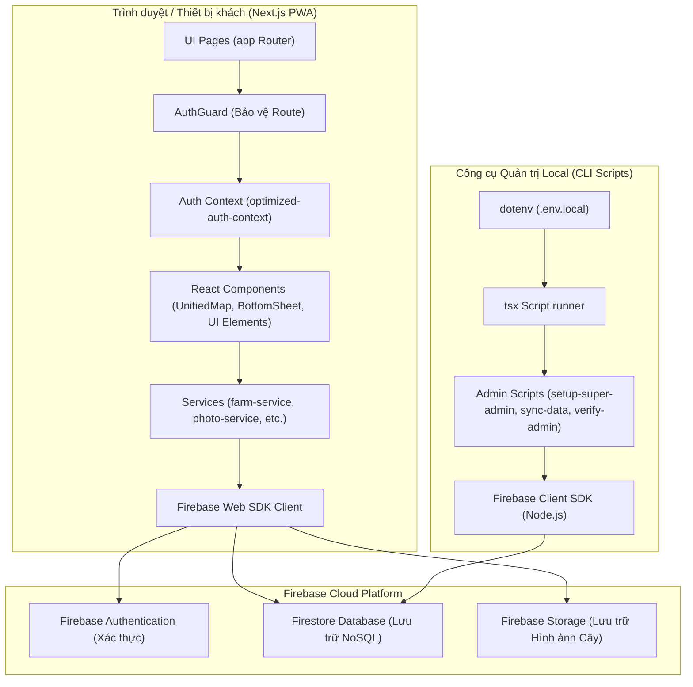
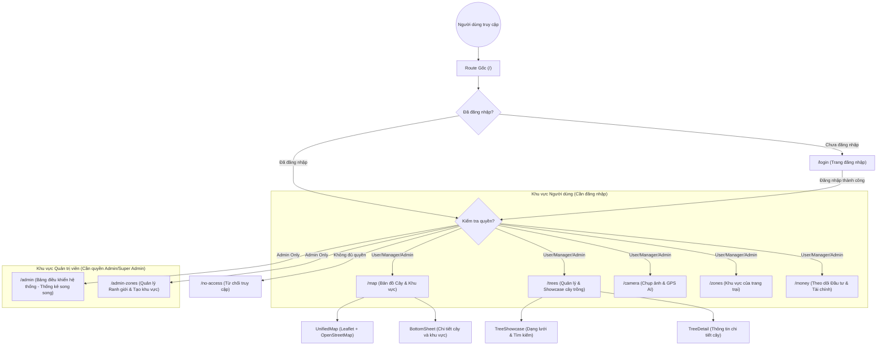

# Farm Manager - Ứng dụng Quản lý Trang trại Sầu Riêng

## Tổng quan

Farm Manager là một ứng dụng di động web (PWA) được thiết kế để quản lý trang trại sầu riêng thông minh. Ứng dụng hỗ trợ chụp ảnh cây trồng bằng AI, theo dõi vị trí GPS thời gian thực, và quản lý dữ liệu nông trại một cách hiệu quả.

## Bản đồ Chi tiết Ứng dụng (Architecture & Application Maps)

Dưới đây là các bản đồ trực quan mô tả cấu trúc hệ thống, luồng dữ liệu điều hướng và cấu trúc cơ sở dữ liệu của ứng dụng.

### 1. Sơ đồ Kiến trúc Hệ thống (System Architecture)
Sơ đồ này mô tả cấu trúc phân lớp của ứng dụng, sự tương tác giữa client-side (Next.js), database (Firebase), và các script CLI quản trị ở môi trường local.


```mermaid
graph TD
    subgraph Client ["Trình duyệt / Thiết bị khách (Next.js PWA)"]
        UI["UI Pages (app Router)"] 
        UI --> AuthGuard["AuthGuard (Bảo vệ Route)"]
        AuthGuard --> Contexts["Auth Context (optimized-auth-context)"]
        Contexts --> Components["React Components (UnifiedMap, BottomSheet, UI Elements)"]
        Components --> LibServices["Services (farm-service, photo-service, etc.)"]
        LibServices --> ClientSDK["Firebase Web SDK Client"]
    end

    subgraph Firebase ["Firebase Cloud Platform"]
        Auth["Firebase Authentication (Xác thực)"]
        Firestore["Firestore Database (Lưu trữ NoSQL)"]
        Storage["Firebase Storage (Lưu trữ Hình ảnh Cây)"]
    end

    subgraph CLI ["Công cụ Quản trị Local (CLI Scripts)"]
        Dotenv["dotenv (.env.local)"] --> TSX["tsx Script runner"]
        TSX --> Scripts["Admin Scripts (setup-super-admin, sync-data, verify-admin)"]
        Scripts --> ClientSDKCLI["Firebase Client SDK (Node.js)"]
    end

    ClientSDK --> Auth
    ClientSDK --> Firestore
    ClientSDK --> Storage

    ClientSDKCLI --> Firestore
```

### 2. Bản đồ Điều hướng & Phân quyền Trang (Navigation & Page Routing Map)
Ứng dụng sử dụng cấu trúc Next.js App Router với `AuthGuard` để bảo vệ các tuyến đường yêu cầu xác thực hoặc phân quyền quản trị viên.


```mermaid
flowchart TD
    Start((Người dùng truy cập)) --> RootRoute["Route Gốc (/)"]
    RootRoute --> CheckAuth{Đã đăng nhập?}
    
    CheckAuth -- Chưa đăng nhập --> Login["/login (Trang đăng nhập)"]
    CheckAuth -- Đã đăng nhập --> AuthGuardRoute{Kiểm tra quyền?}
    
    Login -- Đăng nhập thành công --> AuthGuardRoute
    
    subgraph UserGroup ["Khu vực Người dùng (Cần đăng nhập)"]
        AuthGuardRoute -- User/Manager/Admin --> MapRoute["/map (Bản đồ Cây & Khu vực)"]
        AuthGuardRoute -- User/Manager/Admin --> TreesRoute["/trees (Quản lý & Showcase cây trồng)"]
        AuthGuardRoute -- User/Manager/Admin --> CameraRoute["/camera (Chụp ảnh & GPS AI)"]
        AuthGuardRoute -- User/Manager/Admin --> ZonesRoute["/zones (Khu vực của trang trại)"]
        AuthGuardRoute -- User/Manager/Admin --> MoneyRoute["/money (Theo dõi Đầu tư & Tài chính)"]
    end

    subgraph AdminGroup ["Khu vực Quản trị viên (Cần quyền Admin/Super Admin)"]
        AuthGuardRoute -- Admin Only --> AdminDashboard["/admin (Bảng điều khiển hệ thống - Thống kê song song)"]
        AuthGuardRoute -- Admin Only --> AdminZones["/admin-zones (Quản lý Ranh giới & Tạo khu vực)"]
    end

    AuthGuardRoute -- Không đủ quyền --> NoAccess["/no-access (Từ chối truy cập)"]

    MapRoute --> UnifiedMapComponent["UnifiedMap (Leaflet + OpenStreetMap)"]
    MapRoute --> BottomSheetComponent["BottomSheet (Chi tiết cây và khu vực)"]
    TreesRoute --> TreeShowcaseComponent["TreeShowcase (Dạng lưới & Tìm kiếm)"]
    TreesRoute --> TreeDetailComponent["TreeDetail (Thông tin chi tiết cây)"]
```

### 3. Sơ đồ Thực thể Cơ sở dữ liệu (Database Schema ERD)
Mô tả cấu trúc dữ liệu NoSQL Firestore, các subcollections, và mối quan hệ logic giữa các collection.


```mermaid
erDiagram
    users {
        string uid PK "Mã định danh User"
        string email
        string displayName
        string accountStatus "active | suspended"
        boolean isEmailVerified
        timestamp createdAt
        object preferences "Giao diện, ngôn ngữ, thông báo"
    }
    userRoles {
        string id PK "Mã ID Vai trò"
        string userId FK "userId liên kết với users"
        string roleType "super_admin | admin | manager | viewer"
        string scopeType "system | farm"
        string farmId FK "Liên kết với farms nếu scopeType = farm"
        array permissions "Danh sách quyền hạn cụ thể"
        boolean isActive
    }
    adminConfig {
        string id PK "Mã cấu hình (chỉ có 1 bản ghi: 'main')"
        array superAdminUsers "Mảng các UID có quyền Super Admin tối cao"
        boolean enhancedRoleSystem "Bật hệ thống phân quyền nâng cao"
        string systemVersion "Phiên bản hệ thống"
        timestamp lastUpdated
    }
    farms {
        string id PK "Mã định danh Farm"
        string name "Tên trang trại"
        string ownerId FK "UID của chủ trang trại"
        string ownerName
        boolean isActive
        timestamp createdDate
    }
    farmAccess {
        string id PK
        string farmId FK "Liên kết với farms"
        string userId FK "Liên kết với users"
        string role "owner | manager | worker | viewer"
    }
    trees {
        string id PK "Đường dẫn: farms/{farmId}/trees/{treeId}"
        string farmId FK
        string name "Mã số cây (ví dụ: Ri6-001)"
        string qrCode
        string variety "Ri6 | Monthong | Musang King"
        string zoneCode "Mã khu vực của cây"
        float latitude "Vĩ độ GPS"
        float longitude "Kinh độ GPS"
        string healthStatus "Good | Poor | Needs Attention"
        timestamp plantingDate
        boolean needsAttention
    }
    zones {
        string id PK "Đường dẫn: farms/{farmId}/zones/{zoneId} hoặc /zones/{zoneId}"
        string farmId FK
        string name "Tên khu vực"
        string code "Mã khu vực"
        array boundaries "Mảng các tọa độ GPS {latitude, longitude}"
        float area "Diện tích tính bằng hecta"
        int treeCount "Số lượng cây trong khu vực"
        string color "Mã màu Hex đại diện trên bản đồ"
        boolean isActive
    }
    activityLogs {
        string id PK
        string userId FK "Người thực hiện hành động"
        string action "Loại hành động (ví dụ: login, tree:create)"
        string resource "Tài nguyên chịu tác động"
        string resourceId
        timestamp timestamp
        string status "success | failure"
        object details "Thông tin chi tiết"
    }

    users ||--o{ userRoles : "được gán"
    users ||--o{ farmAccess : "truy cập"
    farms ||--o{ farmAccess : "có danh sách"
    farms ||--o{ trees : "chứa các"
    farms ||--o{ zones : "phân chia thành"
    users ||--o{ activityLogs : "tạo ra"
```

---

## Thông tin Dự án

## Cấu trúc Thư mục

```
/Volumes/Mac Work/React/farm-dashboard-simple/
├── app/                          # Next.js App Router (Các trang chính)
│   ├── layout.tsx               # Layout gốc chứa SimpleAuthProvider
│   ├── page.tsx                 # Trang chủ (Tự động chuyển hướng)
│   ├── globals.css              # Custom CSS styling toàn hệ thống
│   ├── login/                   # Trang Đăng nhập (Email/Password)
│   ├── map/                     # Bản đồ chính (Leaflet + Satellite + Work Mode)
│   ├── trees/                   # Quản lý & Showcase cây trồng
│   ├── camera/                  # Chụp ảnh thực địa tích hợp GPS & AI
│   ├── admin/                   # Bảng điều khiển quản trị hệ thống
│   ├── admin-zones/             # Quản lý & Vẽ ranh giới khu vực (Admin/Owner)
│   ├── money/                   # Quản lý chi phí đầu tư
│   ├── zones/                   # Xem phân khu nông trại
│   └── no-access/               # Trang báo từ chối quyền truy cập
├── components/                  # Các Component React dùng chung
│   ├── UnifiedMap.tsx           # Component bản đồ tích hợp
│   ├── OnFarmWorkMode.tsx       # Chế độ làm việc thực địa (GPS Tracker)
│   ├── TreeDetail.tsx           # Chi tiết thông tin một cây trồng
│   ├── TreeShowcase.tsx         # Showcase cây trồng dạng thẻ
│   ├── AuthGuard.tsx            # Component bảo vệ Route theo quyền hạn
│   ├── Navigation.tsx           # Thanh điều hướng chính (Mobile/Desktop)
│   ├── admin/                   # Các component dành riêng cho trang Admin
│   └── ui/                      # Các component giao diện nhỏ (UI Elements)
├── lib/                         # Thư viện & Dịch vụ (Services)
│   ├── firebase.ts              # Cấu hình Firebase Web Client SDK
│   ├── optimized-auth-context.tsx # Context quản lý xác thực & Cache 3 cấp
│   ├── farm-service.ts          # Quản lý trang trại và quyền truy cập
│   ├── photo-service.ts         # Xử lý upload ảnh và liên kết cây
│   ├── gps-tracking-service.ts  # Dịch vụ theo dõi tọa độ GPS thực địa
│   ├── types.ts                 # Định nghĩa các TypeScript types cơ bản
│   └── types-enhanced.ts        # Định nghĩa kiểu dữ liệu nâng cao
├── archive/                     # Nơi lưu trữ các file code cũ không sử dụng
│   ├── components/              # Component cũ lưu trữ
│   └── test-files/              # Các kịch bản test cũ
├── docs/                        # Tài liệu dự án (Tổ chức theo các thư mục con)
├── public/                      # Tài sản tĩnh (Icons, Manifest, Service Worker)
├── scripts/                     # CLI Scripts quản trị chạy bằng Node.js/tsx
└── e2e/                         # Các kịch bản kiểm thử E2E (Playwright)
```

## Các Trang Chính

### 1. Trang chủ (/)
- Chuyển hướng tự động đến trang đăng nhập hoặc bản đồ tùy theo trạng thái xác thực

### 2. Đăng nhập (/login)
- Xác thực người dùng qua Firebase Auth
- Hỗ trợ email/password
- Chuyển hướng sau đăng nhập thành công

### 3. Bản đồ (/map)
- **Chức năng chính**: Hiển thị bản đồ tương tác với cây trồng và khu vực
- **Tính năng**:
  - Hiển thị cây trồng với vị trí GPS
  - Hiển thị khu vực (zones) với ranh giới
  - Chế độ theo dõi GPS thời gian thực
  - Tìm kiếm và lọc cây trồng
  - Chi tiết cây khi nhấn vào marker

### 4. Quản lý cây (/trees)
- **Chức năng**: Danh sách và quản lý chi tiết cây trồng
- **Tính năng**:
  - Hiển thị danh sách cây theo dạng lưới/mobile
  - Chi tiết đầy đủ của từng cây
  - Hiển thị ảnh và thông tin AI

### 5. Camera (/camera)
- **Chức năng**: Chụp ảnh cây trồng
- **Tính năng**:
  - Sử dụng camera thiết bị
  - Tự động lưu vị trí GPS
  - Tích hợp AI phân tích ảnh

### 6. Quản trị (/admin)
- **Chức năng**: Quản lý hệ thống cho admin
- **Tính năng**:
  - Quản lý người dùng
  - Quản lý trang trại
  - Giám sát hệ thống
  - Cấu hình hệ thống

## Các Component Chính

### Core Components
- **UnifiedMap**: Component bản đồ chính sử dụng Leaflet và Esri Satellite
- **OnFarmWorkMode**: Chế độ làm việc thực địa tối ưu hóa mobile
- **TreeDetail**: Hiển thị thông tin chi tiết và lịch sử cây trồng
- **TreeShowcase**: Giao diện showcase cho cây
- **AuthGuard**: Bảo vệ route yêu cầu xác thực
- **Navigation**: Thanh điều hướng chính

### Admin Components
- **SuperAdminPanel**: Bảng điều khiển quản trị toàn hệ thống
- **AdminDashboardMobile**: Thống kê nhanh hệ thống cho mobile
- **UserManagementMobile**: Quản lý tài khoản và phân quyền
- **FarmManagementMobile**: Quản lý các trang trại trong hệ thống
- **SystemSettings**: Cấu hình các thông số hệ thống

### UI Components
- **BottomSheet**: Sheet trượt từ dưới lên (tối ưu mobile)
- **BottomTabBar**: Thanh tab bar dưới cho màn hình mobile
- **LargeTitleHeader**: Header phong cách lớn (iOS style)
- **OfflineIndicator**: Chỉ báo trạng thái kết nối offline
- **Toast**: Thông báo nhanh hiển thị góc màn hình

## Dịch vụ và Utilities

### Authentication
- **optimized-auth-context.tsx**: Context chính quản lý xác thực bằng Firebase Auth
- Tích hợp hệ thống cache 3 cấp (Memory, LocalStorage, background refresh)
- Tự động đồng bộ trạng thái đăng nhập giữa các tabs trình duyệt

### Database Services (Firestore)
- **farm-service.ts**: Quản lý dữ liệu trang trại và quyền truy cập (`farmAccess`)
- **photo-service.ts**: Upload ảnh lên Firebase Storage và liên kết metadata trong Firestore
- **admin-service.ts**: Dịch vụ quản trị hệ thống, cấp quyền admin và tự động thiết lập farm
- **investment-service.ts**: Ghi nhận và theo dõi các khoản chi phí đầu tư trang trại
- **audit-service.ts**: Ghi lại lịch sử hoạt động hệ thống phục vụ hậu kiểm

### GPS & Sync Services
- **gps-tracking-service.ts**: Tính toán khoảng cách, độ chính xác GPS
- **ios-optimized-gps.ts**: Giải pháp tối ưu GPS chạy nền cho thiết bị iOS Safari
- **offline-sync-service.ts**: Quản lý hàng đợi đồng bộ dữ liệu khi mất kết nối mạng

### Utilities
- **firebase.ts**: Khởi tạo Firebase App, Auth và Firestore
- **types.ts** & **types-enhanced.ts**: Định nghĩa kiểu dữ liệu tĩnh cho dự án
- **logger.ts**: Log thông tin có phân hệ và cảnh báo lỗi
- **validation-utils.ts**: Tiện ích kiểm tra tính hợp lệ của dữ liệu đầu vào

## Cách Thức Hoạt Động Của Dữ Liệu (Data Architecture)

Dự án này là một ứng dụng Serverless hoàn toàn ở phía client. **Không sử dụng các API Routes trung gian (`/api/...`)**. Tất cả các components và services giao tiếp trực tiếp với Firebase Cloud thông qua Firebase Web SDK client-side. Điều này giúp giảm thiểu độ trễ mạng, đơn giản hóa cấu trúc code và tận dụng khả năng offline-first vốn có của Firebase.

## Cơ sở dữ liệu

### Firestore Collections
- **farms/{farmId}/trees**: Dữ liệu cây trồng
- **farms/{farmId}/zones**: Dữ liệu khu vực
- **farms/{farmId}/photos**: Ảnh cây trồng
- **users**: Thông tin người dùng
- **farms**: Thông tin trang trại

### Cấu trúc dữ liệu Tree
```typescript
interface Tree {
  id: string
  farmId: string
  name: string
  qrCode: string
  variety: string
  zoneCode: string
  plantingDate: Date
  healthStatus: string
  latitude: number
  longitude: number
  // ... other fields
}
```

### Cấu trúc dữ liệu Zone
```typescript
interface Zone {
  id: string
  name: string
  boundaries: Array<{ latitude: number; longitude: number }>
  treeCount: number
  area: number
  isActive: boolean
}
```

## Tính năng Nâng cao

### AI Integration
- Phân tích ảnh cây trồng tự động
- Đếm trái tự động
- Phát hiện bệnh tật

### GPS Tracking
- Theo dõi vị trí thời gian thực
- Lưu vị trí khi chụp ảnh
- Tính toán khoảng cách và diện tích

### Real-time Updates
- Đồng bộ dữ liệu thời gian thực qua Firestore
- Cập nhật trạng thái cây trồng
- Thông báo thay đổi

### Mobile Optimization
- Thiết kế responsive cho mobile
- PWA (Progressive Web App)
- Offline support
- Touch gestures

## Quy trình Phát triển

### Setup Development
```bash
npm install
npm run setup:firebase
npm run dev
```

### Testing
```bash
npm run test:firebase
npm run test:minimal
npx playwright test
```

### Build Production
```bash
npm run build
npm start
```

## Bảo mật

### Authentication
- Firebase Auth với email/password
- Role-based access control (RBAC)
- Farm-level permissions

### Data Security
- Firestore security rules
- Input validation
- XSS protection

## Hiệu suất

### Optimization
- Code splitting với Next.js
- Image optimization
- Lazy loading components
- Caching strategies

### Monitoring
- Error tracking
- Performance monitoring
- User analytics

## Triển khai

### Environment Variables
```env
NEXT_PUBLIC_FIREBASE_API_KEY=...
NEXT_PUBLIC_FIREBASE_AUTH_DOMAIN=...
NEXT_PUBLIC_FIREBASE_PROJECT_ID=...
NEXT_PUBLIC_SITE_URL=https://farm-manager.vercel.app
```

### Deployment Platforms
- **Vercel**: Recommended for Next.js
- **Firebase Hosting**: Alternative
- **Docker**: For containerized deployment

## Files Đã Di chuyển vào Storage

### Components không sử dụng
- FarmerFriendlyMap.tsx
- InteractiveMap.tsx
- VectorEnhancedMap.tsx
- CustomFarmVectorMap.tsx
- MapWrapper.tsx
- OpenStreetMap.tsx
- RealTimeTreePositioning.tsx
- OptimizedPhotoViewer.tsx
- ImageGallery.tsx
- TreeImagePreview.tsx
- ShareTreeModal.tsx
- UserInfo.tsx
- MigrationPrompt.tsx

### Pages debug/test
- debug-boundaries/
- debug-farm-assignment/
- test-firebase/
- debug-storage/
- debug-zones/
- test-zones-raw/
- test-firebase-direct/
- test-thumbnails/
- tmp_debug_access/
- test-zones-simple/

### Libraries không sử dụng
- enhanced-auth-context.tsx
- enhanced-auth-service.ts
- background-geolocation.ts
- google-maps-loader.ts
- investment-service.ts
- fertilizer-service.ts
- websocket-service.ts
- farm-service.ts.bak

## Lưu ý Phát triển

1. **Mobile First**: Ứng dụng được thiết kế ưu tiên cho mobile
2. **Offline Support**: Hỗ trợ hoạt động offline cơ bản
3. **Real-time**: Đồng bộ dữ liệu thời gian thực
4. **Scalable**: Kiến trúc dễ mở rộng
5. **Secure**: Bảo mật ở mức cao

## Liên hệ

- **Team**: Farm Manager Development Team
- **Email**: contact@farm-manager.com
- **Website**: https://farm-manager.vercel.app

---

*Documentation generated on 2025-10-03*