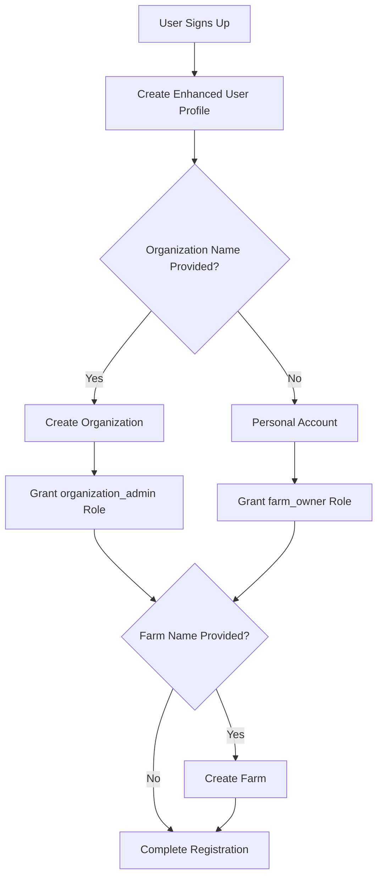
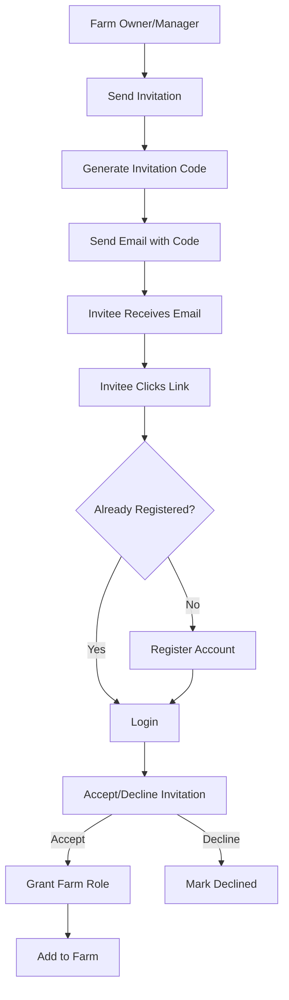
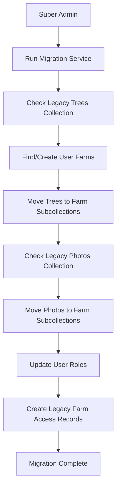

# Enhanced Multi-Tenant Authentication System

## Overview

The Enhanced Authentication System is a comprehensive multi-tenant farm management platform that replaces the simple hardcoded admin system with a scalable, role-based architecture. This system supports multiple farmers, organizations, and collaborative farm management.

## Architecture

### Core Components

```
Enhanced Authentication System
├── Enhanced Auth Service (enhanced-auth-service.ts)
├── Enhanced Auth Context (enhanced-auth-context.tsx)
├── Super Admin Service (super-admin-service.ts)
├── Invitation Service (invitation-service.ts)
└── Enhanced Types (types-enhanced.ts)
```

### Key Features

- **Dynamic Multi-Admin System**: No more hardcoded admin UIDs
- **Role-Based Access Control (RBAC)**: Granular permissions system
- **Organization Hierarchy**: Enterprise-level scaling support
- **Farm Invitation System**: Collaborative farm management
- **Data Migration**: Preserves existing trees, photos, and farm data
- **Activity Logging**: Complete audit trail
- **Backward Compatibility**: Existing components continue to work

## User Roles & Permissions

### Role Hierarchy

```
super_admin (Platform-wide)
├── organization_admin (Organization-level)
│   ├── organization_member (Basic org access)
│   └── farm_owner (Farm ownership)
│       ├── farm_manager (Farm management)
│       ├── farm_viewer (Read-only farm access)
│       ├── seasonal_worker (Temporary access)
│       └── api_user (API-only access)
```

### Permission Categories

#### Tree Management
- `trees:read` - View tree information
- `trees:write` - Create/update trees
- `trees:delete` - Delete trees
- `trees:bulk` - Bulk operations on trees

#### Photo Management
- `photos:read` - View photos
- `photos:write` - Upload/edit photos
- `photos:delete` - Delete photos
- `photos:bulk` - Bulk photo operations

#### Farm Management
- `farms:read` - View farm details
- `farms:write` - Update farm settings
- `farms:delete` - Delete farms
- `farms:create` - Create new farms

#### User Management
- `users:read` - View user information
- `users:invite` - Send farm invitations
- `users:manage` - Manage user roles
- `users:remove` - Remove users from farms

#### System Administration
- `system:admin` - Full system control
- `system:audit` - Access audit logs
- `system:backup` - System backup operations

## Implementation Guide

### 1. Core Service Setup

The system is built around several core services:

#### Enhanced Auth Service
```typescript
import { enhancedAuthService } from './lib/enhanced-auth-service'

// Sign in user and load roles
const user = await enhancedAuthService.signIn(email, password)

// Check permissions
const canManageTrees = enhancedAuthService.hasPermission('trees:write', farmId)

// Check roles
const isSuperAdmin = enhancedAuthService.isSuperAdmin()
```

#### Super Admin Service
```typescript
import { createSuperAdminService } from './lib/super-admin-service'

// Only available to super admins
const superAdminService = createSuperAdminService()

// Create organization
const org = await superAdminService.createOrganization({
  name: 'Acme Farms',
  ownerId: userId
})

// Migrate legacy data
const result = await superAdminService.migrateLegacyData()
```

#### Invitation Service
```typescript
import { invitationService } from './lib/invitation-service'

// Invite user to farm
const invitation = await invitationService.inviteUserToFarm({
  farmId: 'farm123',
  inviteeEmail: 'farmer@example.com',
  proposedRole: 'farm_manager',
  message: 'Join our durian farm!'
})

// Accept invitation
const result = await invitationService.acceptInvitation(invitationCode)
```

### 2. React Integration

#### Enhanced Auth Provider
```typescript
// app/layout.tsx
import { EnhancedAuthProvider } from '@/lib/enhanced-auth-context'

export default function RootLayout({ children }) {
  return (
    <html>
      <body>
        <EnhancedAuthProvider>
          {children}
        </EnhancedAuthProvider>
      </body>
    </html>
  )
}
```

#### Using Enhanced Auth Hook
```typescript
// components/MyComponent.tsx
import { useEnhancedAuth } from '@/lib/enhanced-auth-context'

export function MyComponent() {
  const { 
    user, 
    currentFarm, 
    roles, 
    permissions, 
    hasPermission, 
    isSuperAdmin 
  } = useEnhancedAuth()
  
  // Role-based UI rendering
  if (isSuperAdmin()) {
    return <SuperAdminDashboard />
  }
  
  if (hasPermission('farms:write', currentFarm?.id)) {
    return <FarmManagementUI />
  }
  
  return <ReadOnlyView />
}
```

#### Backward Compatibility
```typescript
// Existing components can continue using the old interface
import { useAuth } from '@/lib/enhanced-auth-context'

export function ExistingComponent() {
  const { user, currentFarm, loading, isAdmin } = useAuth()
  // This continues to work without changes
}
```

### 3. Database Schema

#### User Roles Collection (`userRoles`)
```typescript
interface UserRole {
  id: string                    // Composite: userId_roleType_scopeType_scopeId
  userId: string               // Reference to user
  roleType: RoleType          // Type of role
  scopeType: 'system' | 'organization' | 'farm'
  scopeId?: string            // Organization/Farm ID
  permissions: Permission[]    // Granted permissions
  grantedBy: string           // User who granted the role
  grantedAt: Date
  expiresAt?: Date            // Optional expiration
  isActive: boolean           // Active status
}
```

#### Organizations Collection (`organizations`)
```typescript
interface Organization {
  id: string
  name: string
  displayName?: string
  subscriptionType: 'free' | 'pro' | 'enterprise'
  subscriptionStatus: 'active' | 'suspended' | 'cancelled'
  maxFarms: number
  maxUsersPerFarm: number
  maxUsersTotal: number
  features: OrganizationFeature[]
  settings: OrganizationSettings
  createdAt: Date
  updatedAt: Date
  isActive: boolean
}
```

#### Farm Invitations Collection (`farmInvitations`)
```typescript
interface FarmInvitation {
  id: string
  farmId: string
  organizationId?: string
  inviterUserId: string
  inviteeEmail: string
  inviteeName?: string
  proposedRole: RoleType
  proposedPermissions: Permission[]
  invitationCode: string       // 8-character code
  message?: string
  status: InvitationStatus
  sentAt: Date
  respondedAt?: Date
  expiresAt: Date             // 7 days from creation
}
```

#### Enhanced Users Collection (`users`)
```typescript
interface EnhancedUser extends User {
  phoneNumber?: string
  profilePicture?: string
  language: string
  timezone: string
  lastLoginAt?: Date
  loginCount: number
  isEmailVerified: boolean
  isPhoneVerified: boolean
  accountStatus: 'active' | 'suspended' | 'pending_verification'
  twoFactorEnabled: boolean
  preferences: UserPreferences
}
```

#### Activity Logs Collection (`activityLogs`)
```typescript
interface ActivityLog {
  id: string
  userId: string
  organizationId?: string
  farmId?: string
  action: string               // 'auth:login', 'farm:created', etc.
  resource: string
  resourceId?: string
  details: Record<string, any>
  timestamp: Date
  status: 'success' | 'failure'
}
```

## User Flows

### 1. New User Registration Flow



### 2. Farm Invitation Flow



### 3. Super Admin Migration Flow



## API Reference

### Enhanced Auth Service

#### Authentication Methods
```typescript
// Sign in user
signIn(email: string, password: string): Promise<EnhancedUser>

// Sign up new user
signUp(userData: {
  email: string
  password: string
  displayName: string
  phoneNumber?: string
  organizationName?: string
  farmName?: string
}): Promise<EnhancedUser>

// Sign out
signOut(): Promise<void>
```

#### Permission Management
```typescript
// Check if user has specific permission
hasPermission(permission: Permission, scopeId?: string): boolean

// Check if user has specific role
hasRole(roleType: RoleType, scopeId?: string): boolean

// Check if user is super admin
isSuperAdmin(): boolean

// Grant role to user
grantUserRole(
  userId: string,
  roleType: RoleType,
  scopeType: 'system' | 'organization' | 'farm',
  scopeId?: string,
  grantedBy?: string
): Promise<UserRole>

// Revoke user role
revokeUserRole(roleId: string, revokedBy: string): Promise<void>
```

### Super Admin Service

#### Organization Management
```typescript
// Create organization
createOrganization(data: {
  name: string
  displayName?: string
  subscriptionType?: 'free' | 'pro' | 'enterprise'
  ownerId: string
}): Promise<Organization>

// Get all organizations
getAllOrganizations(): Promise<Organization[]>

// Update organization
updateOrganization(orgId: string, updates: Partial<Organization>): Promise<void>

// Delete organization
deleteOrganization(orgId: string, transferFarmsToOrgId?: string): Promise<void>
```

#### Farm Management
```typescript
// Create farm
createFarm(data: {
  name: string
  organizationId?: string
  ownerId: string
  farmType?: 'personal' | 'commercial' | 'cooperative' | 'research'
  location?: { latitude: number; longitude: number }
}): Promise<EnhancedFarm>

// Get all farms
getAllFarms(): Promise<EnhancedFarm[]>

// Update farm
updateFarm(farmId: string, updates: Partial<EnhancedFarm>): Promise<void>

// Delete farm
deleteFarm(farmId: string): Promise<void>
```

#### System Operations
```typescript
// Migrate legacy data
migrateLegacyData(): Promise<{
  success: boolean
  migrated: number
  errors: string[]
}>

// Get system statistics
getSystemStats(): Promise<{
  totalUsers: number
  totalOrganizations: number
  totalFarms: number
  totalTrees: number
  totalPhotos: number
  activeUsers30Days: number
}>
```

### Invitation Service

#### Invitation Management
```typescript
// Send farm invitation
inviteUserToFarm(data: {
  farmId: string
  inviteeEmail: string
  inviteeName?: string
  proposedRole: RoleType
  customPermissions?: Permission[]
  message?: string
}): Promise<FarmInvitation>

// Accept invitation
acceptInvitation(invitationCode: string): Promise<{
  success: boolean
  farmId: string
  role: RoleType
}>

// Decline invitation
declineInvitation(invitationCode: string, reason?: string): Promise<void>

// Get sent invitations
getSentInvitations(farmId?: string): Promise<FarmInvitation[]>

// Get received invitations
getReceivedInvitations(): Promise<FarmInvitation[]>

// Cancel invitation
cancelInvitation(invitationId: string): Promise<void>

// Resend invitation
resendInvitation(invitationId: string): Promise<void>
```

## Security Considerations

### Permission Validation
- All sensitive operations require permission checks
- Permissions are validated at the service layer
- Role hierarchy is enforced (super_admin > organization_admin > farm_owner)
- Scoped permissions prevent cross-farm access

### Data Isolation
- Organization-level data isolation
- Farm-specific data scoping
- User can only access authorized resources
- Activity logging for audit trails

### Session Management
- Enhanced user profiles with login tracking
- Configurable session timeouts
- Two-factor authentication support (future)
- Email verification required

## Migration Guide

### From Legacy System

1. **Identify Current Admin**: The hardcoded super admin (`O6aFgoNhDigSIXk6zdYSDrFWhWG2`) is automatically migrated

2. **Run Migration Service**:
```typescript
const superAdminService = createSuperAdminService()
const result = await superAdminService.migrateLegacyData()
```

3. **Verify Migration**:
   - Check that trees are moved to farm subcollections
   - Verify photos are properly associated
   - Confirm user roles are granted
   - Test existing functionality

### Updating Components

#### Old Pattern
```typescript
import { useAuth } from '@/lib/auth-context'

function Component() {
  const { user, isAdmin } = useAuth()
  // Simple admin check
}
```

#### New Pattern
```typescript
import { useEnhancedAuth } from '@/lib/enhanced-auth-context'

function Component() {
  const { user, hasPermission, isSuperAdmin } = useEnhancedAuth()
  
  // Granular permission checks
  const canManageTrees = hasPermission('trees:write', farmId)
  const canInviteUsers = hasPermission('users:invite', farmId)
  
  // Role-based rendering
  if (isSuperAdmin()) {
    return <AdminControls />
  }
}
```

## Troubleshooting

### Common Issues

1. **Permission Denied Errors**
   - Check user roles with `getCurrentRoles()`
   - Verify scope IDs match current farm/organization
   - Ensure roles are active and not expired

2. **Migration Issues**
   - Run `migrateLegacyData()` as super admin
   - Check console for migration errors
   - Verify Firebase permissions

3. **Invitation Problems**
   - Check invitation expiry (7 days)
   - Verify email addresses match exactly
   - Ensure inviter has `users:invite` permission

### Debug Commands

```typescript
// Check current user roles
const roles = enhancedAuthService.getCurrentRoles()
console.log('User roles:', roles)

// Check current permissions
const permissions = enhancedAuthService.getCurrentPermissions()
console.log('User permissions:', permissions)

// Get system stats (super admin only)
const stats = await superAdminService.getSystemStats()
console.log('System statistics:', stats)
```

## Future Enhancements

### Planned Features
- [ ] Email service integration for invitations
- [ ] Two-factor authentication
- [ ] API key management
- [ ] Advanced analytics dashboard
- [ ] Bulk user operations
- [ ] Custom role creation
- [ ] Organization billing integration
- [ ] Mobile app authentication

### Performance Optimizations
- [ ] Role caching
- [ ] Permission batching
- [ ] Lazy loading of user data
- [ ] Optimistic UI updates

## Support

For issues related to the Enhanced Authentication System:

1. Check the troubleshooting section above
2. Review Firebase console for data integrity
3. Check browser console for authentication errors
4. Verify environment variables and Firebase configuration

The system maintains full backward compatibility, so existing functionality should continue to work seamlessly while new features are gradually adopted.