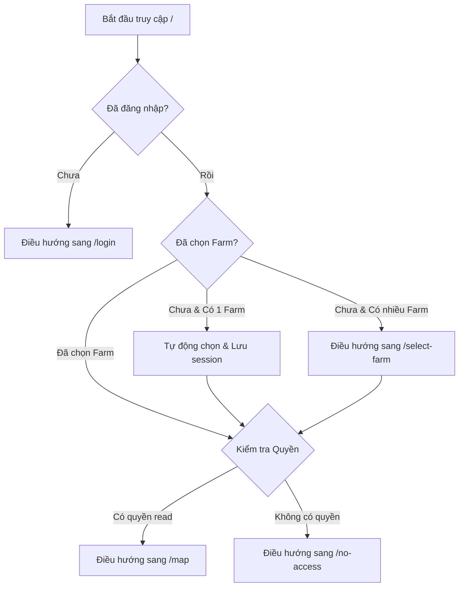

# 🗺️ Tài liệu Hệ thống Giao diện Hiện hành (UI/UX System Design V1)

Tài liệu này được lập ra nhằm giúp Agent trên **Google Stitch** (https://stitch.withgoogle.com/) hiểu rõ cấu trúc hiện tại, luồng điều hướng, phân quyền và danh sách tất cả các trang của hệ thống **FarmManager** (ứng dụng quản lý trang trại sầu riêng thông minh trên di động).

---

## 🌟 0. Tài nguyên Đặc tả Tương tác & Video Walkthrough (Mới)

Để giúp Agent Stitch hiểu sâu sắc về các chức năng động, tương tác và các quy trình ngầm (thay vì chỉ xem hình ảnh tĩnh), hãy tham khảo các tài nguyên bổ sung dưới đây:

1. **🎬 [Video Ghi hình Tương tác Thực tế](file:///Volumes/Mac%20Work/React/farm-dashboard-simple/docs/Design/V1/app-walkthrough.webm)**: Video ghi lại toàn bộ luồng tương tác thực tế từ màn hình Login, chọn trang trại, phóng to thu nhỏ bản đồ, bật chế độ On-farm Work Mode, mở BottomSheet chi tiết cây trồng, chỉnh sửa số lượng trái sầu riêng và duyệt qua giao diện quản trị Super Admin.
2. **⚙️ [Đặc tả Tương tác Chi tiết dạng JSON](file:///Volumes/Mac%20Work/React/farm-dashboard-simple/docs/Design/V1/app-specification.json)**: Chứa cấu trúc đặc tả lập trình về mọi màn hình, phần tử UI tương tác (input, button, toggles), các sự kiện kích hoạt (onClick, onChange) tương ứng với các React state thay đổi và các truy vấn/ghi đè cơ sở dữ liệu Firestore.
3. **🧭 [Tài liệu Quy trình Nghiệp vụ & Thuật toán](file:///Volumes/Mac%20Work/React/farm-dashboard-simple/docs/Design/V1/user-journeys.md)**: Giải thích chi tiết các thuật toán ngầm phức tạp như: định vị chính xác cao bằng GPS Burst, Coordinates Guard chặn lỗi tọa độ 30m, nén ảnh thông minh lưu trữ ngoại tuyến bằng IndexedDB, và thuật toán Point-in-polygon gán phân khu tự động.
4. **⚙️ [Bản tả Kỹ thuật & Tương tác Component](file:///Volumes/Mac%20Work/React/farm-dashboard-simple/docs/Design/V1/functional-spec.md)**: Chi tiết về cấu trúc component Next.js, state React và các file schema Firestore.

---

## 📌 1. Thông tin chung về Công nghệ & Thiết kế hiện tại

- **Framework**: Next.js 14.2 (App Router) sử dụng React 18.
- **Styling**: Tailwind CSS với thiết kế ưu tiên thiết bị di động (Mobile-First).
- **Trình bao bọc di động**: `MobileOnlyWrapper` chặn các thiết bị desktop và hiển thị thông báo yêu cầu truy cập bằng di động (trừ khi bật chế độ Developer Tools giả lập Mobile hoặc kích thước màn hình `< 768px` và có hỗ trợ cảm ứng).
- **Database & Auth**: Firebase Auth (Email/Password) và Firestore database thời gian thực.
- **Bản đồ**: Sử dụng thư viện Leaflet / OpenStreetMap hỗ trợ hiển thị ranh giới nông trại, ranh giới khu vực và vị trí các cây sầu riêng.

---

## 🚦 2. Luồng Điều hướng & Phân quyền (Auth Routing Flow)

Dưới đây là sơ đồ luồng điều hướng trang được biểu diễn bằng Mermaid:

---

## 📸 3. Danh sách các Trang & File Ảnh Chụp Giao diện (V1 Screenshots)

Thư mục chứa ảnh chụp: `docs/Design/V1/`

| STT | Tên ảnh chụp | Đường dẫn (Route) | Mô tả giao diện & Chức năng |
| :--- | :--- | :--- | :--- |
| **01** | `01_login.png` | `/login` | **Trang đăng nhập**: Form nhập Email & Mật khẩu kết nối Firebase Auth. Có khu vực hướng dẫn đăng nhập dành cho nông dân. |
| **02** | `02_no_access.png` | `/no-access` | **Trang chặn truy cập**: Hiển thị khi tài khoản không có quyền xem nông trại hoặc bị khóa. Có nút đăng xuất để chuyển tài khoản. |
| **03** | `03_select_farm.png` | `/select-farm` | **Trang chọn nông trại**: Hiển thị danh sách các nông trại mà người dùng được cấp quyền truy cập. Hỗ trợ tự động tạo nông trại mặc định cho tài khoản mới. |
| **04** | `04_dashboard_map.png` | `/map` | **Trang chủ / Bản đồ (Tab 1)**: Bản đồ vệ tinh Leaflet hiển thị ranh giới các khu vực (Zones) và điểm chấm tròn vị trí từng cây. Cho phép lọc niên vụ/năm ở đầu trang. |
| **05** | `05_zones.png` | `/zones` | **Danh sách khu vực (Tab 2)**: Danh sách các phân khu của nông trại (ví dụ: Khu A, Khu B), hiển thị diện tích và số lượng cây trong mỗi khu. |
| **06** | `06_admin_zones.png` | `/admin-zones` | **Vẽ khu vực**: Trang quản trị dành cho chủ trại để vẽ, chỉnh sửa tọa độ đa giác (Polygon) ranh giới các khu vực trên bản đồ. |
| **07** | `07_trees_list.png` | `/trees` | **Danh sách cây trồng**: Hiển thị toàn bộ cây trong farm dưới dạng danh sách cuộn mượt (virtualized). Có thanh tìm kiếm theo tên/QR, bộ lọc sức khỏe (Khỏe mạnh, Cần chú ý, Yếu), bộ lọc giống sầu riêng và sắp xếp. |
| **08** | `08_tree_detail.png` | `/trees` (Pop-up/Detail) | **Chi tiết cây trồng**: Mở ra khi click vào một cây. Hiển thị: Mã QR, chiều cao, đường kính thân, số trái tự đếm, số trái AI đếm, lịch sử bón phân, làm cỏ, tọa độ GPS và độ chính xác (sai số mét). Có nút **Chỉnh sửa** và **Xóa**. |
| **09** | `09_camera.png` | `/camera` | **Chụp ảnh AI**: Giao diện camera di động cho phép chụp ảnh cây, nhận diện trái bằng AI và đồng bộ nhật ký hình ảnh theo mùa vụ. |
| **10** | `10_investment_money.png`| `/money` | **Quản lý đầu tư (Tab 3)**: Theo dõi chi phí đầu vào của trang trại chia theo các danh mục như Phân bón, Hệ thống tưới, Nhân công, Cây giống, Thuốc BVTV. |
| **11** | `11_super_admin_dashboard.png` | `/admin` | **Bảng điều khiển Super Admin**: Thống kê số lượng Người dùng, Lượt đăng ký chờ duyệt, Thư mời, Tổ chức, Farm và Cây trồng trên toàn hệ thống. |
| **12** | `12_super_admin_users.png` | `/admin` (Tab Thành viên)| **Quản lý Thành viên Admin**: Xem danh sách tất cả các user, duyệt tài khoản đăng ký tự do, gửi thư mời tham gia farm thông qua email. |
| **13** | `13_super_admin_farms.png` | `/admin` (Tab Nông trại) | **Quản lý Farm Admin**: Quản lý danh sách các nông trại, gán farm cho tổ chức hoặc gán quyền sở hữu trực tiếp cho user. |
| **14** | `14_super_admin_roles.png` | `/admin` (Tab Quyền) | **Cấp quyền Admin**: Bảng điều khiển phân quyền chi tiết (Owner, Manager, Worker, Viewer) cùng danh sách 35 permission tương ứng. |
| **15** | `15_super_admin_settings.png` | `/admin` (Tab Hệ thống) | **Cấu hình hệ thống**: Quản lý bộ nhớ đệm offline, kiểm tra trạng thái kết nối Firestore và đồng bộ hóa thủ công cơ sở dữ liệu. |

---

## 🛠️ 4. Hướng dẫn Tái thiết kế trên Google Stitch (Stitch Redesign Guidelines)

Khi nạp tài liệu này và hình ảnh vào Google Stitch, hãy cấu hình cho Agent Stitch tuân theo các yêu cầu trải nghiệm người dùng cải tiến sau:

### 1. Giữ nguyên tính năng cốt lõi (Core Functions)
- **Tập trung vào Mobile**: Giao diện thiết kế mới bắt buộc phải tối ưu cho cảm ứng một tay trên điện thoại di động (Mobile-First), các nút thao tác nhanh (như chụp ảnh, thêm ghi chú, tìm kiếm cây) phải to rõ, dễ nhấn ở vùng dưới màn hình (Safe area).
- **Hỗ trợ chế độ Offline**: Đảm bảo các chỉ số trạng thái đồng bộ, các trường dữ liệu ngoại tuyến được thiết kế trực quan giúp nông dân biết khi nào dữ liệu đã được lưu trữ trên thiết bị.
- **Trực quan hóa Bản đồ**: Cải thiện thiết kế các nút chức năng trên bản đồ Leaflet (đổi chế độ bản đồ, phóng to thu nhỏ, định vị vị trí hiện tại của nông dân trên vườn).

### 2. Nâng cấp trải nghiệm UI/UX (Aesthetics & Layout Redesign)
- **Tông màu tự nhiên, hài hòa**: Thay thế màu xanh lá cây mặc định bằng một bảng màu xanh organic hiện đại (chẳng hạn Emerald/Teal kết hợp với các tông màu đất nhẹ nhõm như Slate, Amber cho trạng thái thu hoạch).
- **Tránh bảng màu thô**: Tránh sử dụng màu đỏ chót hay xanh lét nguyên bản. Dùng các góc bo tròn lớn (`rounded-2xl`, `rounded-3xl`) và hiệu ứng đổ bóng mờ nhẹ để tạo chiều sâu.
- **Tăng cường trải nghiệm Chi tiết cây (Tree Details)**: Chuyển đổi giao diện thông tin cây khô khan thành dạng thẻ thông minh (Smart Cards) chia tab rõ ràng (Sinh trưởng | Chăm sóc | AI | Tọa độ) kèm đồ thị mini (Sparklines) thể hiện chiều cao/đường kính thân qua các năm.
- **Giao diện Super Admin hiện đại**: Giao diện Dashboard quản trị cần dùng biểu đồ trực quan (Charts) thay vì chỉ dùng số liệu tĩnh để thể hiện mức độ tăng trưởng người dùng và hoạt động bón phân.

---

*Tài liệu này được thiết lập tự động bởi Antigravity và lưu trữ cùng bộ ảnh thiết kế V1.*
