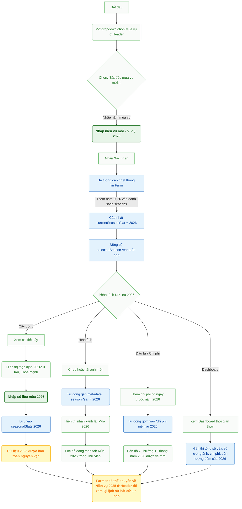

# HƯỚNG DẪN VẬN HÀNH & DI TRÚ NIÊN VỤ MỚI (FARMERS & MANAGERS)

Tài liệu này hướng dẫn chi tiết quy trình vận hành trên ứng dụng **FarmManager** khi trang trại bước vào một mùa vụ thu hoạch mới (ví dụ: chuyển giao từ niên vụ 2025 sang 2026), giúp cô lập số liệu cũ và cập nhật số liệu mới một cách chính xác mà không gây xáo trộn.

---

## 📈 Sơ đồ Quy trình Vận hành (Season Transition Workflow)

Dưới đây là sơ đồ chi tiết các bước thực hiện và sự phân tách dữ liệu tự động của hệ thống khi bắt đầu một niên vụ mới:

---

## 📘 Hướng dẫn Chi tiết cho Người dùng

### Bước 1: Kích hoạt niên vụ mới (Chỉ dành cho Owner/Manager)
Do điều kiện thời tiết mỗi năm khác nhau khiến mùa vụ sầu riêng có thể đến sớm hoặc trễ, hệ thống không tự động chuyển đổi theo lịch dương mà hỗ trợ một nút bấm kích hoạt thủ công.
1. Tại thanh điều hướng phía trên màn hình, nhấp vào dropdown hiển thị năm mùa vụ hiện tại (ví dụ: `Niên vụ 2025`).
2. Chọn dòng **"➕ Niên vụ mới..."**.
3. Nhập số năm niên vụ mới (ví dụ: `2026`) vào hộp thoại và xác nhận.
4. Hệ thống sẽ ghi nhận niên vụ 2026 là niên vụ hiện hành và tự động chuyển giao diện hiển thị của toàn bộ nông trại sang niên vụ 2026.

---

### Bước 2: Cập nhật thông số cây trồng
Khi niên vụ 2026 được kích hoạt, dữ liệu cây trồng sẽ hiển thị trống để sẵn sàng ghi nhận số liệu mới:
- **Số trái & Tình trạng:** Khi mở chi tiết một cây trồng, sản lượng trái đếm được sẽ bắt đầu từ `0` trái, tình trạng sức khỏe được thiết lập mặc định (ví dụ: `Tốt`).
- **Lưu dữ liệu:** Khi nông dân đi vườn và cập nhật số trái đếm được (ví dụ: `75` trái), thông số này sẽ chỉ lưu vào bản ghi lịch sử của niên vụ 2026 (`seasonalStats[2026]`).
- **An toàn dữ liệu:** Hệ thống đảm bảo toàn bộ số trái đếm được, đánh giá sức khỏe và ghi chú của niên vụ `2025` cũ không bị thay đổi hoặc ghi đè.

---

### Bước 3: Quản lý hình ảnh và Thư viện ảnh sinh trưởng
Hình ảnh chụp cây qua các mùa là tài liệu quan trọng để so sánh tốc độ sinh trưởng và phát hiện bệnh dịch:
- **Tự động gắn thẻ:** Khi chụp ảnh trực tiếp tại vườn hoặc tải ảnh lên trong khi niên vụ 2026 đang hoạt động, ảnh sẽ tự động được gán metadata `seasonYear = 2026`.
- **Nhãn trực quan:** Trên lưới hình ảnh, những ảnh này sẽ hiển thị nhãn Badges màu ngọc lục bảo nổi bật ghi rõ **"Mùa 2026"**, giúp phân biệt rõ ràng với ảnh **"Mùa 2025"** (màu xám).
- **Bộ lọc thư viện:** Người dùng có thể nhấn vào các Tab nhanh trong Thư viện: `Tất cả`, `Mùa 2026`, `Mùa 2025` để lọc xem ảnh sinh trưởng riêng biệt của từng năm.

---

### Bước 4: Nhập chi phí đầu tư (Money)
- Khi nhập một khoản đầu tư (ví dụ: Phân bón, Thuốc BVTV, Lao động), hệ thống sẽ đối chiếu ngày thanh toán với năm niên vụ để tự động đưa vào báo cáo tài chính của mùa tương ứng.
- **Biểu đồ tài chính:** Biểu đồ xu hướng chi phí 12 tháng sẽ hiển thị chi tiết từ tháng 1 đến tháng 12 của riêng niên vụ 2026.
- **So sánh hiệu quả:** Thống kê đầu tư sẽ tự động so sánh chi phí niên vụ 2026 với niên vụ 2025 để tính toán biến động chi phí.

---

### Bước 5: Tra cứu lịch sử mùa vụ cũ
Nông dân hoặc người quản lý có thể chọn lại `2025` tại dropdown bộ chọn mùa vụ trên thanh điều hướng bất cứ lúc nào. 
- Ngay lập tức, Bảng điều khiển (Dashboard), Bản đồ số lượng trái, Báo cáo đầu tư, và Thư viện ảnh sẽ chuyển đổi hiển thị trọn vẹn số liệu lịch sử của niên vụ 2025.
