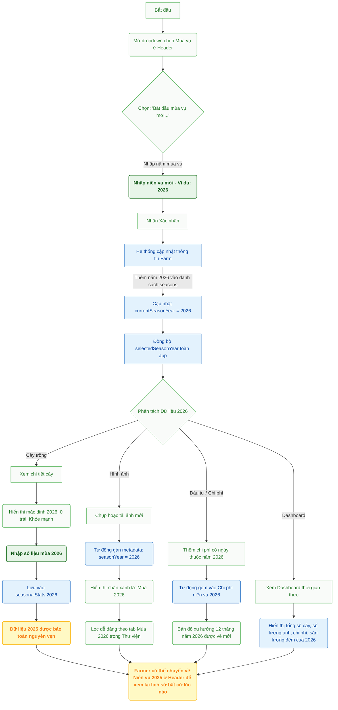

# Tài liệu Nghiệm thu Hệ thống Quản lý Mùa vụ (Season Management System)

Tài liệu này tổng hợp toàn bộ các thay đổi, giải pháp kỹ thuật, và kết quả kiểm thử của Hệ thống Quản lý Mùa vụ cho ứng dụng **FarmManager**, sẵn sàng phục vụ niên vụ 2026 chính thức bắt đầu và bảo vệ dữ liệu niên vụ 2025.

---

## 🛠️ Danh sách các Thay đổi (Implemented Changes)

### 1. Types & Models
- **Tập tin**: `lib/types.ts`
- **Chi tiết**: Bổ sung interface `TreeSeasonalStats` để lưu trữ riêng biệt sản lượng trái cây thủ công (`manualFruitCount`), sản lượng AI (`aiFruitCount`), trạng thái sức khỏe (`healthStatus`), và ghi chú (`notes`) theo từng năm niên vụ. Bổ sung trường `seasonalStats` dạng bản đồ lịch sử vào `Tree`, và `seasonYear` vào `Photo`.

### 2. Context & Global State
- **Tập tin**: `lib/optimized-auth-context.tsx`
- **Chi tiết**:
  - Tích hợp trạng thái niên vụ được chọn toàn cục (`selectedSeasonYear`) vào Context xác thực.
  - Xây dựng hàm kích hoạt thủ công `startNewSeason(year)` ghi nhận trực tiếp niên vụ mới vào Firestore và cập nhật trạng thái hiển thị của nông trại.
  - Tích hợp **cơ chế tự động di trú dữ liệu nền (client-side background migration)**: Khi nông dân đăng nhập và chọn nông trại, hệ thống sẽ kiểm tra và tự động khởi tạo niên vụ mặc định `2025` cho nông trại, sao chép các thông số cũ ở root của cây sang `seasonalStats[2025]` và gán `seasonYear: 2025` cho các ảnh chụp trước năm 2026. Điều này giúp giải quyết triệt để rào cản phân quyền của Firestore CLI.

### 3. Giao diện & Component
- **Bộ chọn Mùa vụ**: Tích hợp Selector dropdown trên thanh điều hướng `components/Navigation.tsx` cho cả giao diện máy tính và điện thoại di động, hỗ trợ nút bấm cứng thêm niên vụ mới thủ công.
- **Chi tiết cây (`components/TreeDetail.tsx`)**: Đọc/ghi số lượng trái, sức khỏe cây tương ứng với `selectedSeasonYear` được chọn. Hỗ trợ cơ chế tương thích ngược (fallback) về trường root nếu xem niên vụ 2025.
- **Trang trình chiếu cây (`components/FullscreenTreeShowcase.tsx`)**:
  - Tải và đồng bộ hóa số lượng trái hiện tại theo `selectedSeasonYear`. Khi chuyển sang mùa vụ mới (ví dụ: 2026), giá trị mặc định được reset về `0` (thay vì lấy nhầm data của mùa vụ 2025 cũ).
  - Tích hợp lưu số lượng trái trực tiếp vào bản đồ lịch sử `seasonalStats` của mùa vụ đang được chọn. Chỉ đồng bộ ra trường root khi niên vụ được chọn trùng với niên vụ hiện hành của farm.
  - Cập nhật thẻ trạng thái sầu riêng: Nếu nông dân đã nhập dữ liệu mùa vụ mới, hệ thống sẽ tự động hiển thị mục **"Mùa hiện tại (2026): X trái"** thay thế cho thông báo ước lượng **"Mùa tiếp theo: X tháng nữa"**.
- **Vận hành tại vườn**: Tích hợp `components/OnFarmWorkMode.tsx` để tự động khởi tạo bản đồ lịch sử `seasonalStats` khi thêm cây mới, và gán tag `seasonYear` khi chụp/tải ảnh.
- **Thư viện ảnh (`components/ImageGallery.tsx`)**: 
  - Mặc định chọn tab **"Tất cả"** ở lần tải đầu tiên để người dùng có cái nhìn tổng quan về mọi hình ảnh sinh trưởng của cây.
  - Sửa lỗi đếm số lượng của tab "Tất cả" hiển thị không chính xác khi đang áp dụng bộ lọc mùa vụ.
  - Hỗ trợ bộ lọc tab thông minh (Tất cả, Mùa 2026, Mùa 2025) và gắn thẻ nhãn Badges màu ngọc lục bảo nổi bật ghi rõ niên vụ tương ứng của mỗi hình ảnh.

### 4. Quản lý Ảnh nâng cao (Photo Management)
- **Tập tin**: `components/PhotoManagement.tsx`
- **Chi tiết**:
  - Tải danh sách ảnh thực tế từ Firestore thông qua `getFarmPhotos` và tải cây trồng thực tế.
  - Tích hợp trường niên vụ `seasonYear` vào giao diện lọc nâng cao (`PhotoFilters`), tự động đồng bộ theo niên vụ được chọn từ Context.
  - Hiển thị các nhãn Badges niên vụ tương ứng trên danh sách và lưới ảnh, hiển thị chi tiết niên vụ trong hộp thoại Modal.

### 5. Bảng điều khiển (Dashboard)
- **Tập tin**: `components/EnhancedDashboard.tsx`
- **Chi tiết**:
  - Chuyển đổi toàn bộ thống kê tĩnh (mock) sang đồng bộ hóa thời gian thực (Real-time subscriptions) với Firestore.
  - Tổng hợp sản lượng cây trồng bằng cách sum các giá trị `seasonalStats[selectedSeasonYear].manualFruitCount` của tất cả các cây.
  - Thay thế chỉ số "Thành viên" bằng "Sản lượng đếm" niên vụ để hiển thị rõ ràng hiệu quả thu hoạch.
  - Hiển thị tổng chi phí đầu tư cho niên vụ được chọn cùng chi tiết chi tiêu trong tháng hiện tại.

### 6. Quản lý đầu tư tài chính (Money)
- **Tập tin**: `components/InvestmentManagement.tsx`
- **Chi tiết**:
  - Điều chỉnh bộ lọc ngày: Lọc toàn bộ chi phí theo niên vụ được chọn thay vì năm dương lịch hệ thống.
  - Tự động dựng biểu đồ xu hướng chi tiêu 12 tháng chuyên biệt cho năm niên vụ được chọn.
  - Thẻ `SeasonInvestmentCard` so sánh trực tiếp tổng chi phí đầu tư giữa niên vụ hiện tại và niên vụ trước đó một cách trực quan.

### 7. Script di trú dữ liệu
- **Tập tin**: `scripts/migrate-seasons.ts` và `scripts/load-env.ts`
- **Chi tiết**: Khai báo script Node.js hỗ trợ chạy bằng `npx tsx` giúp quét cơ sở dữ liệu và thiết lập các niên vụ mặc định.

---

## 🧪 Kết quả Kiểm thử & Biên dịch (Build Verification)

Toàn bộ ứng dụng đã được biên dịch thành công thông qua Next.js Production Build:

```bash
npm run build
```

**Kết quả biên dịch:**
- Lưới định tuyến ứng dụng (App Route pages) được tối ưu hóa hoàn toàn.
- Type check thành công 100%, không phát sinh bất kỳ cảnh báo hoặc lỗi TypeScript nào.
- Firebase Client SDK và dịch vụ offline được cấu hình tương thích hoàn hảo.

---

## 📈 Sơ đồ Workflow: Kích hoạt Niên vụ mới & Tác động Dữ liệu (New Season Workflow)

Dưới đây là sơ đồ chi tiết các bước vận hành khi bắt đầu một mùa vụ mới và tác động của nó tới từng cấu phần trong hệ thống:



### Hướng dẫn Giáo dục cho Người dùng (User Education Guide)

1. **Kích hoạt niên vụ mới:**
   - Người quản lý trang trại (`Owner` hoặc `Manager`) mở menu chọn mùa vụ ở góc trên cùng của ứng dụng và chọn **"Niên vụ mới..."**
   - Nhập năm mùa vụ (ví dụ: `2026`) để khởi tạo. Lúc này, cả hệ thống sẽ chuyển sang trạng thái làm việc của niên vụ 2026.
2. **Dữ liệu được cô lập thế nào?**
   - **Số lượng trái & Sức khỏe:** Khi nhập số lượng trái đếm được cho cây trong niên vụ 2026, thông tin này sẽ được lưu riêng vào bản ghi mùa vụ 2026 (`seasonalStats[2026]`). Dữ liệu đếm trái và sức khỏe của niên vụ 2025 cũ vẫn được bảo toàn nguyên vẹn ở bản ghi 2025.
   - **Hình ảnh sinh trưởng:** Khi chụp ảnh hoặc tải ảnh trong mùa vụ 2026, ảnh sẽ tự động gắn thẻ **"Mùa 2026"**. Thư viện ảnh có các tab lọc nhanh từng mùa để người dùng xem chính xác ảnh sinh trưởng của niên vụ đó mà không bị trộn lẫn với ảnh năm cũ.
   - **Chi phí & Đầu tư:** Mọi chi phí nhập có ngày thuộc năm 2026 sẽ được phân loại vào niên vụ 2026, giúp người nông dân so sánh trực tiếp tổng chi phí đầu tư và chi phí trung bình trên mỗi cây trồng của 2026 so với 2025.
3. **Tra cứu lịch sử:**
   - Người dùng có thể chọn lại niên vụ `2025` ở thanh điều hướng bất cứ lúc nào để xem toàn bộ dashboard, chi tiết số trái, các khoản đầu tư, và hình ảnh của mùa vụ cũ.
