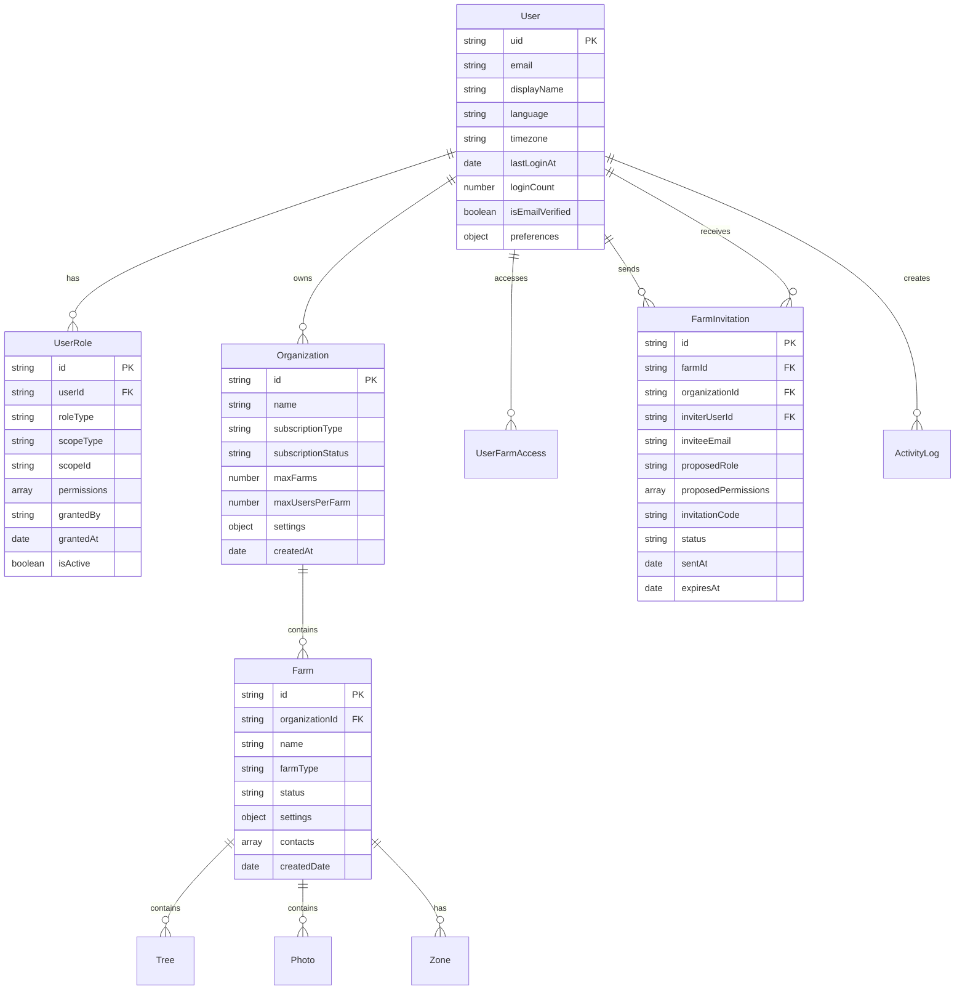
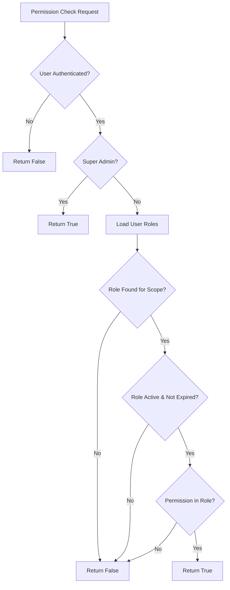
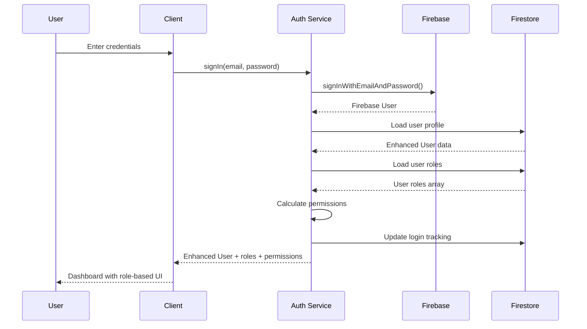
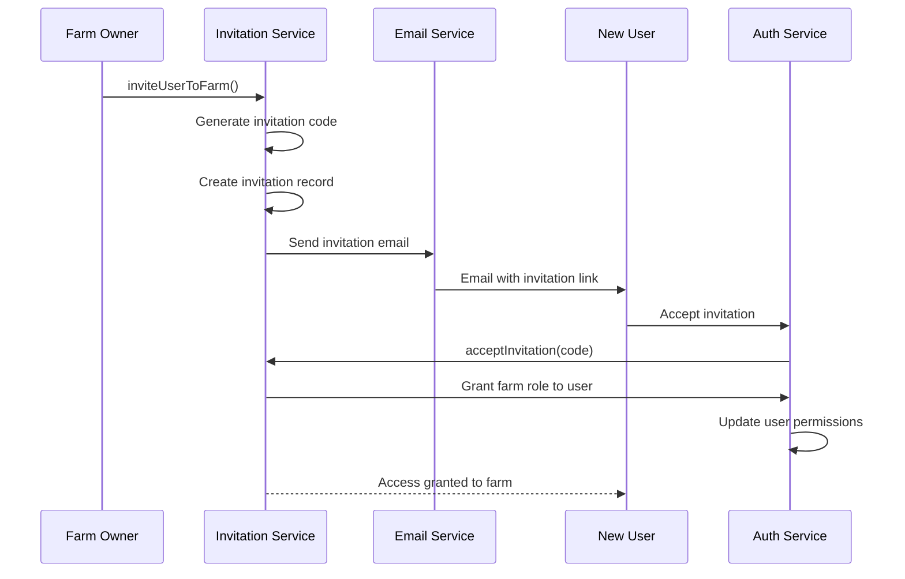
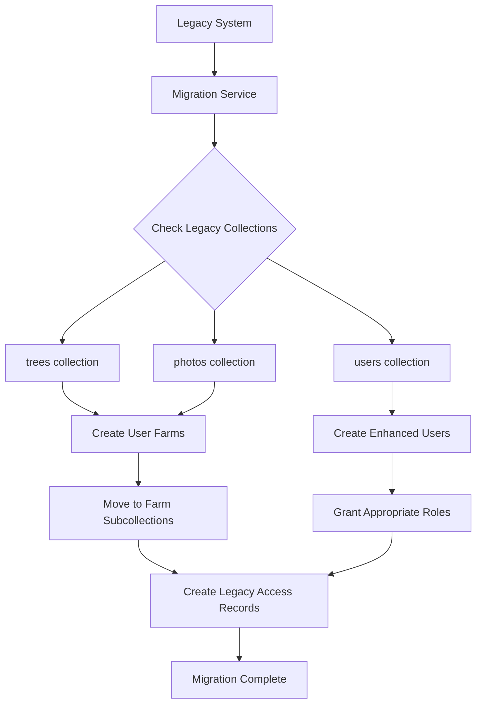

# Enhanced Authentication System - Architecture

## System Architecture Overview

```
┌─────────────────────────────────────────────────────────────────┐
│                    Farm Management Platform                      │
├─────────────────────────────────────────────────────────────────┤
│                      Frontend (Next.js)                        │
├─────────────────────────────────────────────────────────────────┤
│  Enhanced Auth Context  │  Components  │  Pages  │  Services    │
├─────────────────────────────────────────────────────────────────┤
│                   Enhanced Auth Services                        │
├─────────────────────────────────────────────────────────────────┤
│    Firebase Auth    │   Firestore   │   Storage   │   Functions │
├─────────────────────────────────────────────────────────────────┤
│                      Firebase Platform                          │
└─────────────────────────────────────────────────────────────────┘
```

## Component Architecture

### Core Services Layer

```
Enhanced Authentication Services
├── EnhancedAuthService
│   ├── User Authentication (signIn, signUp, signOut)
│   ├── Profile Management (loadUserProfile, updateProfile)
│   ├── Role Management (grantUserRole, revokeUserRole)
│   ├── Permission Checking (hasPermission, hasRole, isSuperAdmin)
│   └── Data Migration (migrateUserProfile, migrateLegacyFarmData)
│
├── SuperAdminService
│   ├── Organization Management (CRUD operations)
│   ├── Farm Management (CRUD operations)
│   ├── User Management (getAllUsers, deleteUser)
│   ├── System Analytics (getSystemStats)
│   └── Data Migration (migrateLegacyData)
│
└── InvitationService
    ├── Invitation Management (invite, accept, decline)
    ├── Invitation Queries (getSent, getReceived)
    ├── User Management (removeUserFromFarm)
    └── Email Integration (sendInvitationEmail)
```

### React Context Layer

```
Enhanced Auth Context
├── Authentication State
│   ├── user: EnhancedUser | null
│   ├── firebaseUser: FirebaseUser | null
│   └── loading: boolean
│
├── Authorization State
│   ├── roles: UserRole[]
│   ├── permissions: Permission[]
│   └── organizations: Organization[]
│
├── Resource State
│   ├── farms: EnhancedFarm[]
│   └── currentFarm: EnhancedFarm | null
│
└── Action Methods
    ├── signIn, signUp, signOut
    ├── hasPermission, hasRole, isSuperAdmin
    ├── setCurrentFarm, refreshUserData
    └── updateProfile, sendEmailVerification
```

## Database Schema

### Collections Overview

```
Firestore Database
├── users/                          # Enhanced user profiles
├── organizations/                  # Organization management
├── farms/                         # Enhanced farm information
│   └── {farmId}/
│       ├── trees/                 # Farm-specific trees
│       ├── photos/                # Farm-specific photos
│       ├── zones/                 # Farm zones
│       ├── investments/           # Investment records
│       └── manualEntries/         # Manual data entries
├── userRoles/                     # Role-based access control
├── userFarmAccess/               # Legacy compatibility
├── farmInvitations/              # Invitation system
├── activityLogs/                 # Audit trail
└── systemConfig/                 # System configuration
```

### Data Relationships



## Permission System Architecture

### Role Hierarchy

```
Permission Hierarchy
└── super_admin (System Level)
    ├── system:admin, system:audit, system:backup
    ├── org:admin, org:settings, org:billing
    └── ALL lower-level permissions
    
    └── organization_admin (Organization Level)
        ├── org:admin, org:settings, org:users
        ├── farms:read, farms:write, farms:create
        └── users:read, users:invite, users:manage
        
        └── farm_owner (Farm Level)
            ├── farms:read, farms:write
            ├── trees:*, photos:*, investments:*, zones:*
            ├── users:read, users:invite, users:manage
            └── analytics:view, analytics:export
            
            └── farm_manager (Operations Level)
                ├── farms:read
                ├── trees:read, trees:write, trees:bulk
                ├── photos:read, photos:write, photos:bulk
                ├── investments:read, investments:write
                └── analytics:view
                
                └── farm_viewer (Read-only Level)
                    ├── farms:read
                    ├── trees:read
                    ├── photos:read
                    ├── investments:read
                    └── analytics:view
```

### Permission Checking Flow



## Authentication Flow

### User Sign-In Process



### Farm Invitation Flow



## Data Migration Architecture

### Legacy to Enhanced Migration



### Data Transformation

```
Legacy Structure → Enhanced Structure

trees/                          farms/{farmId}/trees/
├── {treeId}                   ├── {treeId}
│   ├── userId: "user123"      │   ├── farmId: "farm123"
│   ├── qrCode: "T001"         │   ├── qrCode: "T001"
│   └── ...                    │   └── ...
                               
photos/                        farms/{farmId}/photos/
├── {photoId}                  ├── {photoId}
│   ├── userId: "user123"      │   ├── farmId: "farm123"
│   ├── treeId: "tree001"      │   ├── treeId: "tree001"
│   └── ...                    │   └── ...

users/                         users/
├── {userId}                   ├── {userId}
│   ├── email: "..."           │   ├── email: "..." (unchanged)
│   └── displayName: "..."     │   ├── displayName: "..." (unchanged)
                               │   ├── language: "vi-VN" (new)
                               │   ├── timezone: "Asia/Ho_Chi_Minh" (new)
                               │   ├── preferences: {...} (new)
                               │   └── ...

                               userRoles/ (new)
                               ├── {userId}_farm_owner_farm_{farmId}
                               │   ├── userId: "user123"
                               │   ├── roleType: "farm_owner"
                               │   ├── scopeType: "farm"
                               │   ├── scopeId: "farm123"
                               │   └── permissions: [...]
```

## Security Architecture

### Multi-Layer Security Model

```
Security Layers
├── Frontend Security
│   ├── Role-based UI rendering
│   ├── Permission-based feature access
│   └── Client-side validation
│
├── Service Layer Security
│   ├── Permission validation before operations
│   ├── Scope-based access control
│   ├── Role hierarchy enforcement
│   └── Activity logging
│
├── Database Security
│   ├── Firestore security rules
│   ├── User authentication required
│   ├── Document-level access control
│   └── Field-level permissions
│
└── Infrastructure Security
    ├── Firebase Authentication
    ├── HTTPS enforcement
    ├── API rate limiting
    └── Environment variable protection
```

### Permission Validation Chain

```
Request → Authentication Check → Role Validation → Permission Check → Scope Verification → Action Execution
    ↓               ↓                    ↓                ↓                   ↓              ↓
Firebase       User Profile         User Roles       Permission       Scope Match     Execute &
  Auth         Exists & Active      Are Active       Exists           (farm/org)       Log
```

## Scalability Considerations

### Horizontal Scaling Strategy

```
Scaling Dimensions
├── Organizations
│   ├── Unlimited organizations supported
│   ├── Subscription-based feature gating
│   └── Isolated data per organization
│
├── Farms per Organization
│   ├── Configurable limits by subscription
│   ├── Independent farm data
│   └── Cross-farm analytics capability
│
├── Users per Farm
│   ├── Role-based user limits
│   ├── Invitation-based growth
│   └── Permission inheritance
│
└── Data per Farm
    ├── Firestore subcollection structure
    ├── Efficient querying patterns
    └── Automatic data partitioning
```

### Performance Optimization

```
Optimization Strategies
├── Data Structure
│   ├── Denormalized for read performance
│   ├── Indexed fields for queries
│   └── Compound indexes for complex queries
│
├── Caching Strategy
│   ├── User roles cached in context
│   ├── Permissions calculated once
│   ├── Farm data lazy loaded
│   └── Organization data cached
│
├── Query Optimization
│   ├── Paginated large datasets
│   ├── Real-time subscriptions for live data
│   ├── Batch operations for bulk updates
│   └── Composite queries for efficiency
│
└── Code Splitting
    ├── Lazy-loaded admin features
    ├── Dynamic imports for large components
    ├── Service workers for caching
    └── Optimistic UI updates
```

## Monitoring & Observability

### Activity Logging System

```
Activity Logs Structure
├── Authentication Events
│   ├── Login attempts (success/failure)
│   ├── Logout events
│   └── Password resets
│
├── Authorization Events
│   ├── Role grants/revokes
│   ├── Permission changes
│   └── Access denials
│
├── Business Logic Events
│   ├── Farm creation/updates
│   ├── Tree management
│   ├── Photo uploads
│   └── Invitation activities
│
└── System Events
    ├── Migration operations
    ├── Configuration changes
    ├── Error conditions
    └── Performance metrics
```

### Error Handling Strategy

```
Error Handling Layers
├── Frontend Error Boundary
│   ├── React error boundaries
│   ├── User-friendly error messages
│   └── Fallback UI components
│
├── Service Layer Errors
│   ├── Proper error typing
│   ├── Contextual error messages
│   ├── Error logging
│   └── Graceful degradation
│
├── Database Errors
│   ├── Connection error handling
│   ├── Permission error translation
│   ├── Query timeout handling
│   └── Retry mechanisms
│
└── Infrastructure Errors
    ├── Firebase service errors
    ├── Network connectivity issues
    ├── Authentication failures
    └── Storage errors
```

This architecture provides a solid foundation for a scalable, secure, and maintainable multi-tenant farm management platform.